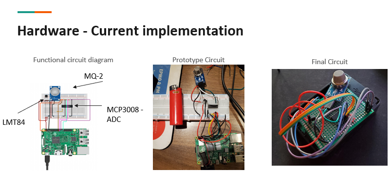
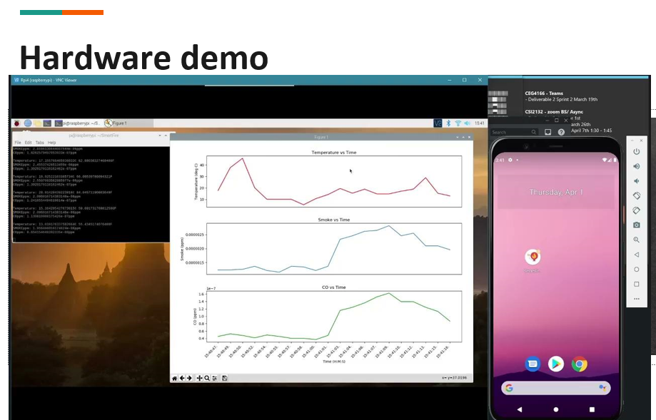

This repository was made by the SmartFire team for the class CEG4912 - Computer ENG Design Project I at the University of Ottawa.

This repository contains all code for the hardware portion of the SmartFire project.

smokeTest.py is the main file for testing the fire alarm component of the project, consisting of the smoke, gas and temperature sensors.
This file uses the Analog_Inputs_for_Raspberry_Pi_Using_the_MCP3008.py file to invoke all MCP3008 analog input pins.

intervalVibrate.py is used to invoke and send timed interval signals resulting in vibrations on the wristband wearable portion of the project.

All other files are being used as testing files for each individual component of the hardware.

After downloading all files and extracting, to run the main smoke alarm component, simply run the smokeTest.py file using the command line while being connected to the Raspberry Pi 4 and
all components as decribed in the Project Report. Alternatively, one can test the wristband wearable by running intervalVibrate.py in the command line with all the required hardware as
indicated in the project report.

Plot 1 - Temperature(&deg;C) vs Time.

Plot 2 - Smoke(ppm) vs Time.

Plot 3 - Carbon Monoxide(ppm) vs Time.

